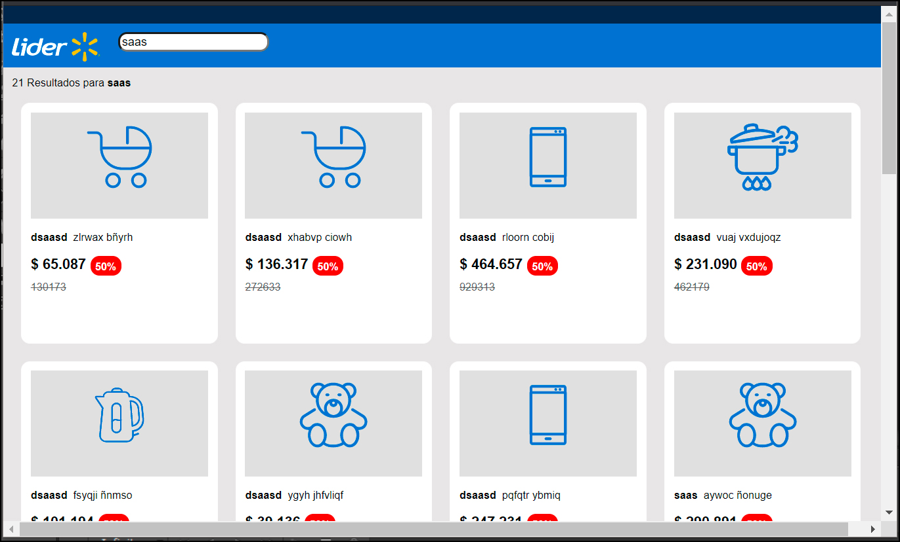

# wallmart-test
## Ejecutar en Máquina Local

Asegúrese de tener instalado [Node.js](http://nodejs.org/) y [Heroku Toolbelt](https://toolbelt.heroku.com/).

```sh
git clone https://github.com/FIXDISC/wallmart-test  # o crea tu propio fork
cd wallmart-test
npm install
npm start
```

La aplicación debiera estar corriendo en [localhost:5000](http://localhost:5000/).

## Lanzando a Heroku

```
heroku create wallmart-test
git push heroku master
heroku open
```

### URL Demo
[wallmart-test.herokuapp.com](https://wallmart-test.herokuapp.com/)


### URL Tests Unitarios
[wallmart-test.herokuapp.com/test](https://wallmart-test.herokuapp.com/test)

